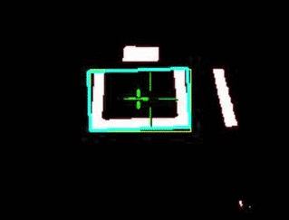

# Computer Vision

## Machine Learning Approach

In general, ML-based vision models take a lot of processing power and tend to be inconsistent if not trained properly. However, they are capable of detecting objects from various different perspectives and are helpful at detecting cargo.

### Object Detection with TensorFlow Lite/Vuforia

?> TensorFlow Lite is a lightweight adaptation of TensorFlow, a machine learning library made by Google, designed for embedded systems. Vuforia is an AR engine that helps with the object detection.

  

Object detection is fairly common in FTC, with pre-trained models provided each year on the [FTC SDK](https://github.com/FIRST-Tech-Challenge/FtcRobotController). Although the plug-and-play capability of object detection is great, it's shown to be inconsistent at detecting game pieces. FTC recently released a [cloud-based toolkit](https://ftc-ml.firstinspires.org/) to help teams create custom object detection models.

## Classic CV

Classic CV models are faster and more consistent than ML-based models, but lack the ability to detect objects without some form of distinction between the object and the background.

### Color Filtering and Contour Detection

Color filtering and contour detection is commonly used in FRC, but can also be used in FTC. Color filtering involves thresholding and changing the color of the image to make it easier to see targets. Contour detection takes the contours of the image and identifies the targets by a user-specified threshold. By combining these two, you can consistently identify color-specific targets. 

  

Because of potential background noise from similar colors, FRC uses retroreflective targets with directed LEDs from the camera. Although this method is effective indoors, it's pretty annoying to work with outdoors and completely blinds anyone looking at the camera.

  

  

Although color filtering and contour detection isn't very common in FTC, it's still possible to use it. You can leverage the [OpenCV library](https://opencv.org/) to perform your own color filtering and contour detection to detect custom game pieces or cargo.

### AprilTag Detection

?> AprilTags are a type of fiducial marker that look similar to QR codes. Fiducial markers are commonly used for AR technology and medical imaging.