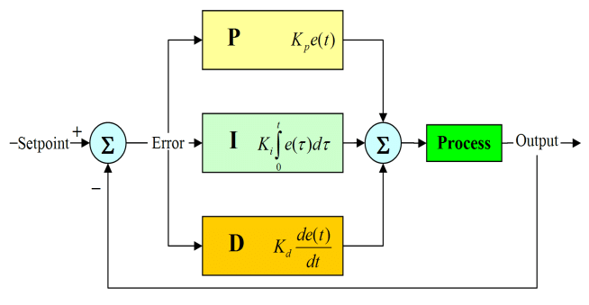

# Control Systems

## PID(F) Controller

PID controller stands for proportional-integral-derivative controller, a widely used control loop that utilizes feedback in a combination of three different terms to calculate the power needed to reach a given setpoint. All three terms must be individually tuned through trial and error, but most applications don't require all the terms; some only need a P or PD controller. If you don't want to use a term, set its gain to 0.

### P (Proportional) Term

The first term simply multiplies the gain by the error. For example, if your error is 100 and your gain is 0.005, your resulting output will be 50% power (0.5). If your gain is too high, your mechanism may start oscillating. If it's too low, your mechanism will never reach its setpoint. Because of the sensitive nature of the P term, it's imperative that you take time to carefully tune it.

!> Some PID controllers, such as the built-in CTRE ones for FRC, integrate a base value into their calculations, requiring the gains to be larger. The SHPLib [PIDController]() class doesn't do this due to the varying resolution of different encoders in FTC.

### I (Integral) Term

The second term takes the error from previous iterations and integrates them over time. The I term can be used if your mechanism never quite reaches the setpoint, however, you should only do so if changing your P term or adding a feedforward doesn't help. A recommended value to start with for your I gain is 1/100th of the P gain.

?> Drivetrain PID controllers may benefit from having an I term if your robot is overshooting the distance setpoint.

### D (Derivative) Term

The third term estimates the trend of the error based on it's rate of change and dampens the output accordingly. If your mechanism accelerates too aggressively while attempting to reach the setpoint, adding a D term can help dampen it. A recommended value to start with for your D gain is anywhere from 10 to 100 times the P gain.

### F (Feedforward) Term

The last term is a static value that gets added to your output. An F term is helpful to counteract forces like gravity or friction. However, for velocity-dependent mechanisms like drivetrains, it's recommended that you tune a [feedforward controller](/advanced-concepts/control-systems?id=feedforward-control) and add it to the output instead of adding an F term.

!> The SHPLib [PIDController]() class does not have the F term included because it's a simple static value that can be added to your output. The F term can be added outside of the PID controller in your `setPower` method call.

## Feedforward Control

## Motion Profiling

## Profiled PID Controller

## Bang Bang Controller
